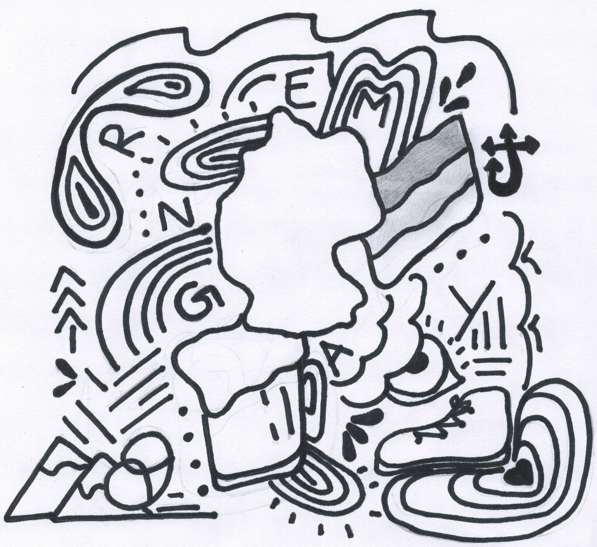
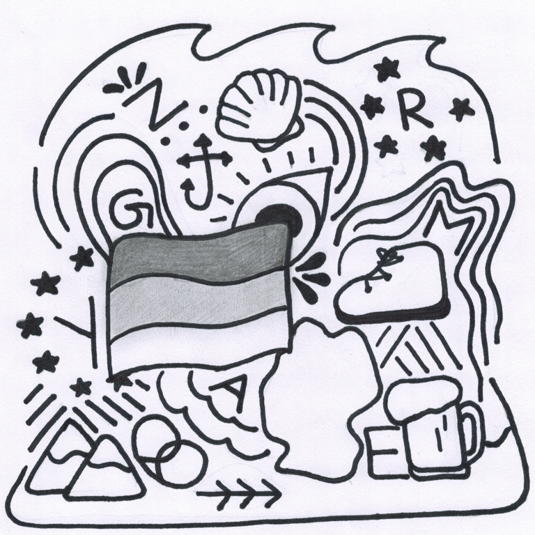

# 🎨 Design Contest

## Rules

1. **Prizes** - Students will vote on the best designs and the winners (as determined by total of unique votes) will receive free German Club apparel. First prize wins $100, second prize $50, and third prize $25.
2. **Eligibility** - All students may enter this competition. Entries will be considered valid for entry as long as they conform to the below standards and are created with the best interests of our German Club in mind.
3. **Standards** - To ensure that the design will attract the widest possible audience, the _German Club T-Shirt_ should not be specific to Kennesaw, Kennesaw State, or the KSU German Club. Your design should appeal to learners of German, and members of German Clubs, regardless of location.
4. **Intellectual Property** The KSU German Club may not produce shirts with KSU's identity, so we must ask that your designs avoid Kennesaw references (for instance, no use of the name, owls, wings, or black/gold color patterns). Finally, artistic submissions to this contest will be attributed but become the intellectual property of KSU German Club.
5. **Submissions** - Students should submit their entries to the contest email address (Club Co-advisor: Dr. Goldblatt, [ngoldbla@kennesaw.edu](mailto:ngoldbla@kennesaw.edu)) as soon as they are complete. Include your name and contact information. Once the German Club finds that a sufficient number of entries qualify for voting, submissions will conclude and public voting will begin.

## Voting on Submissions

After sufficient time and entries we will host a voting session for these artworks and throw the next big design up on a shirt for German students around the world to enjoy! For now, we welcome your feedback on the submissions below.

## Student Submissions

<figure><figcaption>
Submission 01, Madita Bergmann
</figcaption></figure>

<figure><figcaption>
Submission 02, Madita Bergmann
</figcaption></figure>

<figure><figcaption>
Submission 03, Madeline Meyer
</figcaption></figure>

<figure><figcaption>
Submission 04, Madeline Meyer
</figcaption></figure>
