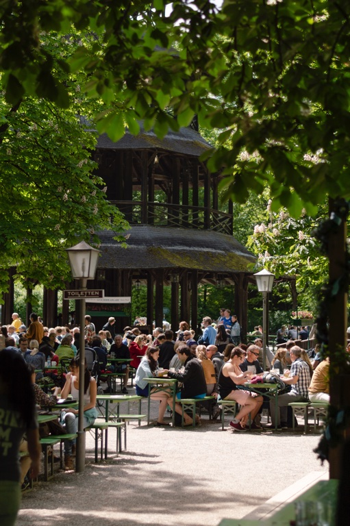
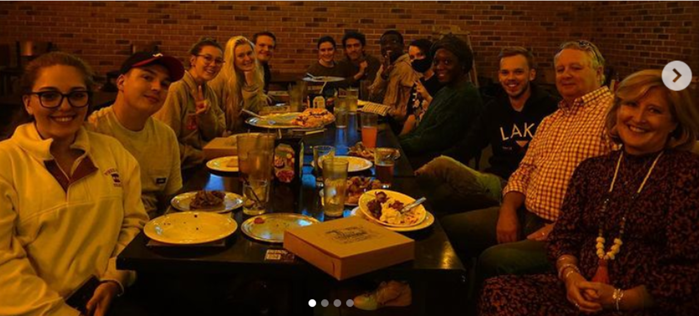

# 🫕 Stammtisch

### What is a Stammtisch? 

The German word _Stammtisch_ means a table for regulars and such tables are typically held by informal groups on a regular basis. These groups often meet at a large table in a cozy location in a cafe, restaurant, or pub. The Stammtisch is above all a friendly get-together and informal!

<figure><figcaption>
<em>Hier sitzen die, die immer hier sitzen.</em>
</figcaption></figure>

### When is the next Stammtisch? 

Our next Stammtisch is scheduled for **March 19, 2024 at 6 pm at Mellow Mushroom** [near the Kennesaw campus!](#user-content-fn-1)[^1] Join the KSU German Club if you’d like to contribute and/or help organize our next event!

<figure><figcaption></figcaption></figure>

### Recent Stammtisch Events 

* Mellow Mushroom, March 19, 2024
* Mellow Mushroom, September 12, 2023
* Mellow Mushroom, October 25, 2022
* Miller’s Ale House, March 31, 2022
* Miller’s Ale House, April 14, 2022
* November 18, 2021
* Cracker Barrel, October 21, 2021
* Mellow Mushroom, September 23, 2021
* Sweet Hut, February 19, 2020

[^1]: 1133 Chastain Rd, Kennesaw, GA 30144
