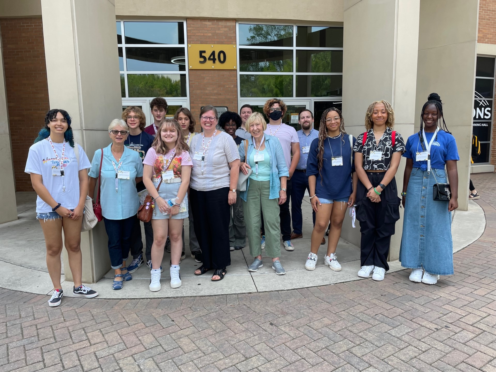

# 🏕 Summer Camp (2024)

## Schedule and Location 

Kennesaw State University will host a German Summer Camp on **Tuesday, July 9, 2024**. The event will take place on the Kennesaw Campus in the Social Science Building or Academic Learning Center Building from 8 am to 5 pm. The event hosts are the Department of World Languages and Cultures in the Norman J. Radow College of Humanities and Social Sciences (RCHSS).

## **Goals** 

1. Have fun with German - and learn about music, culture, and summer activities - and have in hand an award-winning project at the end of the day!
2. Make new friends over the course of a day that has you explore your own creativity and the KSU campus

## **Program Details** 

* Get to know your peers in a social setting over a breakfast snack.
* Meet the organizers and learn about music and summer in the city - German style!
* Learn how to write your own lyrics, poem, or your own summer 2024 “Ohrwurm”
* Participate in the March Madness Music Competition to select your winning song!
* Join us for lunch at the KSU Commons - our treat!
* Get over the “Schnitzel Koma” with a Campus Scavenger Hunt - win a prize!
* Practice German pronunciation, projection and “aesthetic force” in an interactive recitation session
* Finalize your masterpiece!
* Present your work and celebrate your creative genius - Herzlichen Glückwunsch!

## Costs 

Open to all learners who completed their 2nd year of German and are excited to spend a fun-filled day with German language and culture. Cost is $13 per person and includes breakfast snacks and lunch at the award-winning KSU dining hall, the Commons.

## Waiver 

In order to participate in the German Summer Camps, all students and their legal parents or guardians must agree to a waiver of liability. The release and waiver of liability and indemnity agreement should be read in full here ([link](https://protectingminors.kennesaw.edu/docs/KSU%20Minors%20Waiver%20and%20Release.pdf)) before registration. During registration, participants will be asked to confirm that they have consulted the document and that they agree to its terms.

## Registration 

Students who wish to participate should book using an online payment and registration process. Visit the registration page where you can submit payment for the program and provide all of your information. There is a two step process. First you will complete an information survey, and after you submit that you can provide payment via credit or debit card.


Visit our [**online portal**](https://whop.com/ksu-german-studies/) to register for KSU's German Summer Camp this July!


## Schedule 

📅July 9, 2024 8 am – 5 pm

<table data-header-hidden><thead><tr><th width="214"></th><th></th></tr></thead><tbody><tr><td><strong>Time</strong></td><td><strong>Activity</strong></td></tr><tr><td>8:00 – 9:00</td><td>Donut/Breakfast Hour, to encourage students to come early</td></tr><tr><td>9:00 – 9:15</td><td>Welcome / Opening Convocation</td></tr><tr><td>9:15 – 10:05</td><td>Session 1 – Music Video Activity Worksheet</td></tr><tr><td><strong>10 Minute break</strong></td><td></td></tr><tr><td>10:15 – 11:00</td><td>Session 2 – How to write a poem/song</td></tr><tr><td><strong>10 Minute break</strong></td><td></td></tr><tr><td>11:10 – 12:00</td><td>Session 3 – March Madness</td></tr><tr><td>12:00 – 1:00</td><td>Lunch</td></tr><tr><td>1:10 – 2:00</td><td>Session 4 – Scavenger Hunt to Bookstore</td></tr><tr><td><strong>10 Minute break</strong></td><td></td></tr><tr><td>2:10 – 3:00</td><td>Session 5 – How to recite a poem (pronunciation)</td></tr><tr><td><strong>10 Minute break</strong></td><td></td></tr><tr><td>3:10 – 4:00</td><td>Session 6 – time to write / practice reciting poem</td></tr><tr><td>4:00 – 5:00</td><td>Presentation of poems / awards</td></tr></tbody></table>

Breaks can be used for bathroom, photos around campus (Berlin Wall / green), or visiting virtual exhibits.

## **Questions and Contact** 

Dr. Sabine Smith, [ssmith2@kennesaw.edu](mailto:ssmith2@kennesaw.edu) 470.578.6366 (messages only)

Special note: we encourage students to carpool due to limited visitor parking.

<figure><figcaption>
German Summer Camp 2023
</figcaption></figure>
