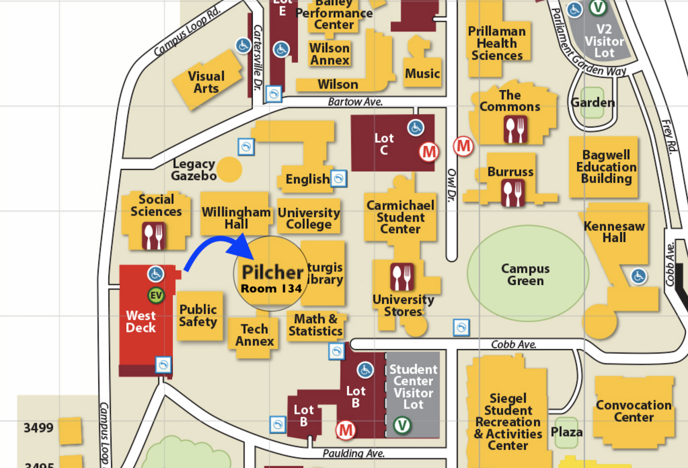

# 🍿 Conversation & Culture

## Kaffeeklatsch 

Each semester the German Studies program offers a weekly conversation hour known as Kaffeeklatsch. This semester there are two sessions.


By appointment in the World Languages Resources Center, in Pilcher 134.



Thursdays 12:30-1:30 in the Starbucks on the 1st floor of the Social Sciences Building.


## German Tutoring

Kennesaw State University hosts a [World Languages Resource Collection](https://radow.kennesaw.edu/wlrc/index.php) (WLRC) in Pilcher Hall, Room 134. This newly renovated language lab is a state-of-the-art facility for language learners and we can't wait to spend time with you there! The German tutor will be present for drop-in face-to-face or remote sessions at the language lab this semester according to the following schedule.&#x20;


Spring 2024 German Tutoring with [Desiree Bessler](mailto:dbessler@students.kennesaw.edu): please contact Desiree for the schedule


* [**Make a Face-to-Face Appointment**](https://outlook.office365.com/owa/calendar/WorldLanguagesResourceCollection2@kennesawedu.onmicrosoft.com/bookings/s/TT32eTkOn0OP0ZsYIwLGGw2)
* [**Make an MS Teams Appointment**](https://outlook.office365.com/owa/calendar/WorldLanguagesResourceCollection2@kennesawedu.onmicrosoft.com/bookings/s/gVqoXIDaKkikg1opw-34dQ2)
* [**Meet in the virtual lab**](https://teams.microsoft.com/l/channel/19%3aea675708ac5c43ed99d2a590337b6b13%40thread.tacv2/General?groupId=4ce45450-0c37-4248-ac8a-661ea53b6fa1\&tenantId=45f26ee5-f134-439e-bc93-e6c7e33d61c2)

<figure><figcaption>
WLRC in Pilcher 134
</figcaption></figure>

## Atlanta Metro Area Events

Visit [**German Events**](https://www.germanevents.org/calendar) for an up-to-date calendar with all German, Austrian, and Swiss events to be hosted in the Atlanta Metro.

## Podcasts 

Most podcasts are multi-platform. They are linked here from varied sources, but many can be found by title wherever you listen to podcasts.

* [True Crime Germany](https://open.spotify.com/show/0RPti4v7SYR5Uyep8bK9x7?si=tPQ-0vwSQKmRp0KdIdXRFA)
* [Apokalypse & Filterkaffee](https://podcasts.google.com/feed/aHR0cHM6Ly9hcG9rYWx5cHNlLXVuZC1maWx0ZXJrYWZmZWUucG9kaWdlZS5pby9mZWVkL21wMw?ep=14)
* [Podcast ohne (richtigen) Namen](https://podcasts.google.com/feed/aHR0cHM6Ly9wb2RjYXN0b2huZW5hbWVuLnBvZGlnZWUuaW8vZmVlZC9tcDM?ep=14)
* [Nightlounge](https://podcasts.google.com/feed/aHR0cDovL2ZlZWRzLnNvdW5kY2xvdWQuY29tL3VzZXJzL3NvdW5kY2xvdWQ6dXNlcnM6MzMwOTE3NTM2L3NvdW5kcy5yc3M?ep=14)
* [WDR 2 Kabarett](https://podcasts.google.com/feed/aHR0cHM6Ly93d3cxLndkci5kZS9tZWRpYXRoZWsvYXVkaW8vd2RyMi93ZHIyLWthYmFyZXR0L2thYmFyZXR0LXBvZGNhc3QtMTAwLnBvZGNhc3Q?ep=14)
* [Baywatch Berlin](https://podcasts.google.com/feed/aHR0cHM6Ly9iYXl3YXRjaC1iZXJsaW4ucG9kaWdlZS5pby9mZWVkL21wMw?ep=14) (or [Apple Podcasts](https://podcasts.apple.com/us/podcast/baywatch-berlin/id1488376434))
* [Game Two: Montalk & Press Select](https://podcasts.google.com/feed/aHR0cHM6Ly9yc3MubmV4eC5jbG91ZC8wMDdETDA4Qk1FMkZTTw?ep=14)
* [Plauschangriff](https://podcasts.google.com/feed/aHR0cDovL3JvY2tldGJlYW5zLnR2L3BsYXVzY2hhbmdyaWZmLnhtbA?ep=14)
* [Chaosradio](https://podcasts.google.com/feed/aHR0cHM6Ly9jaGFvc3JhZGlvLmRlL2ZlZWQvbXAz?ep=14)
* [WDR Hörspiel-Speicher](https://podcasts.google.com/feed/aHR0cHM6Ly93d3cxLndkci5kZS9tZWRpYXRoZWsvYXVkaW8vaG9lcnNwaWVsLXNwZWljaGVyL3dkcl9ob2Vyc3BpZWxzcGVpY2hlcjE1MC5wb2RjYXN0?ep=14)
* [Gemischtes Hack](https://podcasts.apple.com/us/podcast/gemischtes-hack/id1292709842)
* [Bleib Gesund](https://podcasts.apple.com/us/podcast/bleib-gesund-podcast/id1530070152)
* [Düsseldorf-Aufwacher](https://podcasts.apple.com/us/podcast/d%C3%BCsseldorf-aufwacher-der-nachrichtenpodcast-von-rp/id1485140931)

## Film & TV 

The KSU WLRC provides a library of German film content, which may be checked out and viewed in physical copies. If you prefer to stream your content on your own devices, here are some suggestions. Subtitle quality may vary. If this is your first time searching for German language media content, try using this [website](https://languagelearningwithnetflix.com/catalogue.html#language=German\&country=United%20States), which catalogues the best German movies and shows on Netflix according to the country where you subscribe (default: USA). If you want to maximize your comprehension while watching German audio sources, try using 📖 [this Chrome extension](https://www.doublesubs.com/?ref=producthunt) (for YouTube and Netflix) that provides double subtitles and other functionality.

* M (1931)
* The Baader-Meinhof Complex
* Berlin, I Love You
* im juli
* Lola rennt / Run Lola Run
* System Crasher
* Die drei !!!
* Willkommen bei den Hartmanns
* Vienna Blood
* Dark
* Babylon Berlin
* Monaco Franze
* Kir Royale
* Das Boot
* Toni Erdmann
* Der Pass

## Music 

Diversify your listening habit with music from the German-speaking world. Check out these artists or post your own suggestions here!

## Spotify 



### Deutschpop 

* Sarah Connor
* Lena Meyer-Landrut
* Herbert Grönemeyer
* Nena
* Yvonne Catterfeld
* Annemarie Eilfeld
* Bill Kaulitz
* Mark Forster
* Lea
* Silbermond
* Die Ärzte
* Die Toten Hosen

### Deutschrap 

* Fettes Brot
* Die fantastischen Vier
* Edgar Wasser
* Deichkind
* Angry Teng
* Seeed
* Sido
* Fatoni
* OG Keemo

### Metal & Punk 

* Valbourg
* Vasari
* Team Scheisse

## YouTube and FAQs 

Sometimes students of German culture seek out non-fictional clips by and about the German-speaking world on YouTube. Alternatively, some North American audiences may seek to better understand their own culture to enhance their proficiency with another culture. Here are clips on various topics that are included for these purposes.

### Transportation 

* Why do North American residents often consider walking, cycling, or riding the bus to be so onerous? [On Stroads](https://youtu.be/ORzNZUeUHAM).
* Why are passenger trains fast in Europe but slow in the United States? [About rail](http://zierke.com/shasta\_route/pages/17willstay.html) in the US vs. Europe.
