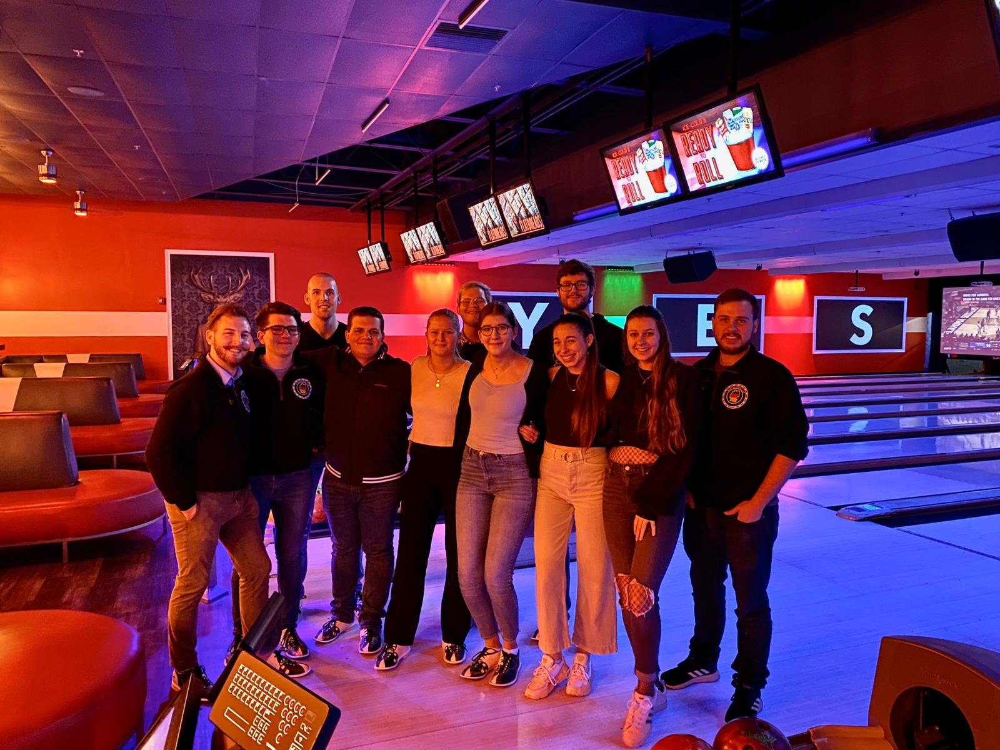

# 📅 German Club

## Welcome to German Club! 

The German Club of Kennesaw State University is a German language and culture club that welcomes all who are interested in learning about German culture, customs, and practicing conversational German. Members need not speak German and are not required to be enrolled in courses of German at any level. Students who attend the German club meetings will be exposed to various German customs as well as to the language.

### Membership 

_All registered KSU students are eligible for membership in the German Club_. Voting members shall be designated as those students who have attended most meetings in an academic semester. There are currently no dues or fees for membership. The only requirement for membership is a desire to be a part of KSU in an extracurricular affiliation and the desire to expand knowledge of German culture and language.

### Campus Community 

Join our club and subscribe to event postings and organization updates.



### **Follow and Discover** 

Follow the German Club and Herr Goldblatt on your favorite app.



<figure><figcaption>
KSU German Club meets at Bowlero in Kennesaw, GA
</figcaption></figure>

