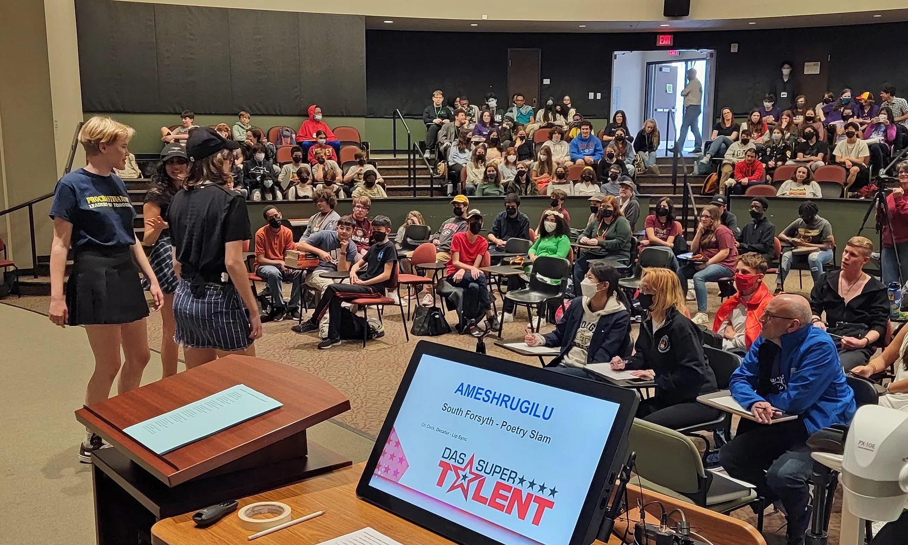
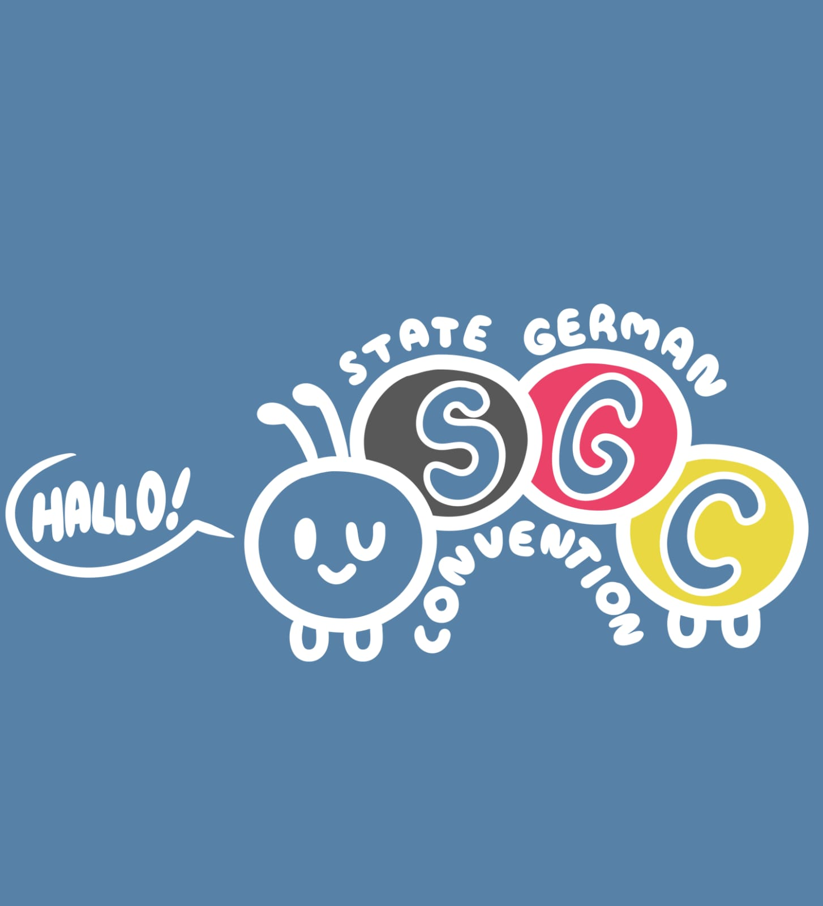

# 🎒 German Convention

Among the many highlights of our State German Convention are the opportunities students have to compete in various events, both as individuals and with others from their schools, highlighting their abilities and accomplishments in the German language. The Supertalent competition (depicted here) invites classes of German students from across Georgia to perform and impress audiences with language skills, choreography, and special talents.

<figure><figcaption></figcaption></figure>

## 2023 Convention 

The 2023 AATG-Georgia State German Convention occured **February 10-11, 2023 at** [Camp Jackson](http://www.georgiaffacamp.org/)! The theme for the 2023 convention was **UMWELT**. [**Learn More**](https://www.aatg-georgia.com/state-german-convention)

<figure><figcaption></figcaption></figure>
