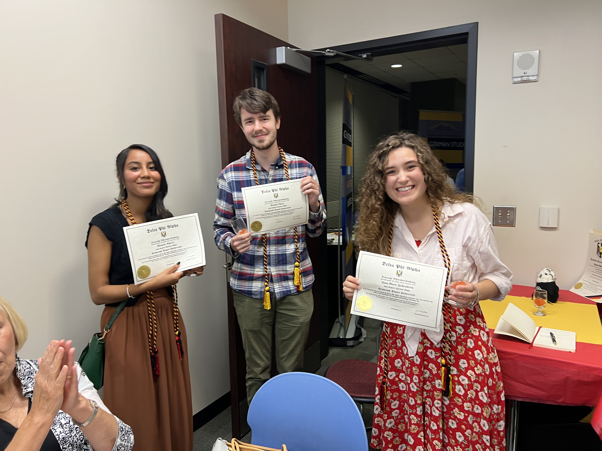

# 🏅 German Honor Society

<figure><figcaption>
KSU German Studies students at The Halle Foundation in Buckhead, GA.
</figcaption></figure>

## Benefits 

Delta Phi Alpha offers several scholarships to recognize and support high-achieving Delta Phi Alpha undergraduate students and after your induction you will be eligible to apply. Delta Phi Alpha’s scholarship application deadlines are each year on **March 15th** and **November 15th**. Additionally, the KSU German Studies program will consider Upsilon Alpha membership as part of numerous distinguishing criteria when determining eligibility for competitive program selection in both domestic and international grant-funded opportunities.

## Eligibility 

You are invited to apply for membership in Kennesaw State University’s Upsilon Alpha chapter of the National German Honor Society Delta Phi Alpha if you have met the following criteria:

* Sophomore Status
* Modern Language and Culture/German Studies major or minor
* Currently enrolled in an upper-level German Studies course
* Cumulative GPA of 3.0 or better
* Completed a minimum of 30 hours of German Studies related community engagement
* Continued interest in the study of German language, literature, and culture
* Commitment to KSU’s German Studies program as participant in curricular and extra-curricular opportunities
* Ability to attend the induction ceremony in person

## Call for Applications 

You are invited to apply for membership in Kennesaw State University’s Ypsilon Alpha chapter of the National German Honor Society Delta Phi Alpha.


[apply-to-the-honor-society.md](../forms/apply-to-the-honor-society.md)


The application link will walk you through the key steps, but there are a couple of things to note. If you wish to submit your application, you will need to write a brief reflection statement, upload a copy of your resumé, and discuss how you participated in the German-speaking community during your studies.&#x20;

Once your application has been reviewed and accepted, your financial obligations are $35 for chapter fees and a lifetime membership.

For questions and more information visit Delta Phi Alpha’s website [http://deltaphialpha.org/](http://deltaphialpha.org/) or contact the KSU chapter advisors: Sabine Smith at [ssmith2@kennesaw.edu](mailto:ssmith2@kennesaw.edu) & Dylan Goldblatt [ngoldbla@kennesaw.edu](mailto:ngoldbla@kennesaw.edu).

## Gallery

<figure><figcaption></figcaption></figure>

<figure><figcaption></figcaption></figure>

<figure><figcaption></figcaption></figure>

<figure><figcaption></figcaption></figure>

<figure><figcaption></figcaption></figure>
