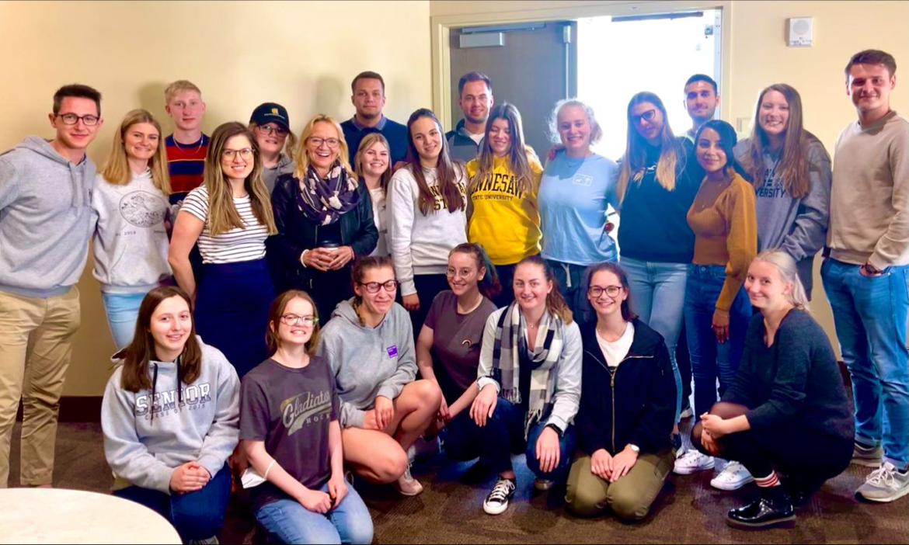

# 🏢 Peer Buddy Program


Michelle introduces the Peer Buddy Program


## Overview 

* **Compensation**. Payment is $400 for full contracts (at min 30 hours over 6 weeks) or $200 for partial contracts. The rate is approximately $13 per hour.
* **Duties**. Students craft a brief personal profile, assist our German visitors upon arrival in mid-March, join in on site visits (as time and schedule allow), give an in-class presentation on the experience, and submit a time log at the end.
* **Contracts**. You make a commitment when you sign a contract, but you can change from full to partial contract and from partial to full contract as appropriate and documented via time log.
* **Timeline**. Apply by the third week of Spring semester to participate this semester.

## Application 


[apply-for-an-experience.md](../forms/apply-for-an-experience.md)


## Description 

For six weeks this semester you can serve as a "Peer Buddy" or "Suitemate" (you room with them in a hotel at no cost to you) to approximately two Germans your age, selected by our grant-funding partners, the Herz Foundation of Hamburg, Germany. In being their friend and KSU liaison, supported with guidelines and prompts to not make it awkward, you learn about each other’s personal and professional lives and about German and US American culture. No special knowledge is necessary - just a willingness to help these Germans practice English and make friends!

<figure><figcaption></figcaption></figure>

## Testimonials 

> A highlight of this program is the chance to meet up and talk to our peer buddies. The buddies are students of KSU and volunteered to talk to us online regularly. This weekly appointment with fixed topics quickly developed itself into great and personal talks. From the differences in healthcare in both Germany and the US to our favorite snacks we covered all kinds of topics already. The whole group of German participants is very happy about it and we all hope that, sooner or later, we can meet our buddies in person. [Read more](https://azubisgousa.wordpress.com/2021/04/20/we-can-see-the-finish-line/).

> We welcomed our guest speaker, Vanya Allan, she is a multidisciplinary artist, designer, educator, and architecture student. \[...] She gave a lecture, which was very informative and rousing. She told us about the topic of racism, the language of the African Americans and about the code-switching. She has a specific role in organizing in the BLM movement, which supports African-American oppression. She also feels that Black Lives is the correct terminology and is not just for African American, but also affects all of humanity. [Read more](https://azubisgousa.wordpress.com/2021/04/06/our-second-virtual-meeting-goes-on/).

> Finally, our virtual trip to the USA started and everybody was very excited and had lots of expectations. We are a team of 18 trainees from all over Germany and the organizing team, 1 from Hamburg, as well as two persons from Atlanta. Unfortunately, we can’t fly to Atlanta, but instead, we will meet virtually every Friday for the next 6 weeks to learn more about American culture, business, U.S. college life and current events. [Read more](https://azubisgousa.wordpress.com/2021/03/30/our-exiting-virtual-journey-begins/).

## Step by Step 


Max describes the KSU Peer Buddy experience

