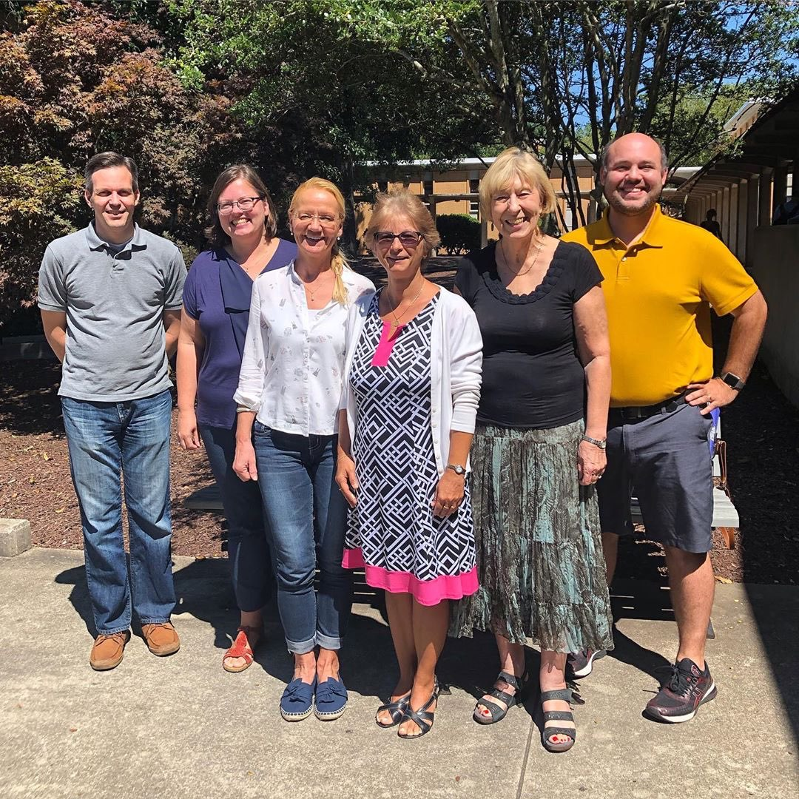

# 🧑🏫 Our Faculty

<figure><figcaption></figcaption></figure>

### Directory

<table data-view="cards"><thead><tr><th></th><th></th><th></th><th data-hidden data-card-cover data-type="files"></th></tr></thead><tbody><tr><td>Dr. Sabine Smith Professor  Pilcher 253 ssmith2@kennesaw.edu</td><td></td><td></td><td><a href="../.gitbook/assets/Sabine_pfp.png">Sabine_pfp.png</a></td></tr><tr><td>
Dr. Shane Peterson

Associate Professor Pilcher 248 speter71@kennesaw.edu
</td><td></td><td></td><td><a href="../.gitbook/assets/Shane_pfp.png">Shane_pfp.png</a></td></tr><tr><td>Dr. Dylan Goldblatt Senior Lecturer Pilcher 240 ngoldbla@kennesaw.edu</td><td></td><td></td><td><a href="../.gitbook/assets/Dylan_pfp.png">Dylan_pfp.png</a></td></tr><tr><td>Magdalena Constantin Instructor  Pilcher 221 mconsta@kennesaw.edu</td><td></td><td></td><td><a href="../.gitbook/assets/Magda_pfp.png">Magda_pfp.png</a></td></tr><tr><td>Susanne Estrella Instructor Pilcher 221 sestrell@kennesaw.edu</td><td></td><td></td><td><a href="../.gitbook/assets/Susanne_pfp.png">Susanne_pfp.png</a></td></tr><tr><td>Sabina Carlson  Instructor  Pilcher 221 scarls14@kennesaw.edu</td><td></td><td></td><td><a href="../.gitbook/assets/Sabina_pfp.png">Sabina_pfp.png</a></td></tr><tr><td>Janet Ward Instructor Pilcher 221 jward61@kennesaw.edu</td><td></td><td></td><td><a href="../.gitbook/assets/Janet_pfp.png">Janet_pfp.png</a></td></tr></tbody></table>
