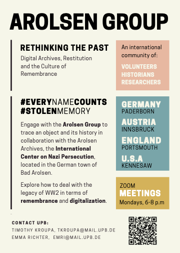

# 👷 Internships (US)

## Make a Difference with German 

Discover ways to serve and lead with German in your community. Learn how you can contribute to meaningful projects in your community that will have the positive benefit of improving your life satisfaction and job prospects. Apply now for co-curricular experiences and share your passion for German. Here are four options to get started.

## Join the Arolsen Group 

KSU students can join German, Austrian, and British students for a series of lectures, film screenings and discussions, and lots of opportunities to make friends and connections in Europe.&#x20;

<figure><figcaption></figcaption></figure>

You can also participate in the digital initiative: #[EveryNameCounts](https://www.zooniverse.org/projects/arolsen-archives/every-name-counts).


Trailer for the Every Name Counts project


## Foster Community in the Atlanta Metro 

Practice your German and establish a pen-pal correspondence with Georgia's German-speaking seniors. Earn bonus points in your course, or simply enjoy learning how to write a postcard in German – and get something much better than a bill in the mail in return!


Interviews with Frau Mathilde, Frau Christa, und Frau Lily


## **Curate and Translate Museum Exhibits** 

If you are interested in history, museum work, and language study, our collaboration with the [KSU Museum of History and Holocaust Education](https://historymuseum.kennesaw.edu/) (MHEE) may offer you an entry point to your future career! Join us in our project of translating video subtitles, exhibit panels, and audio guides to “[Anne Frank In Translation](https://historymuseum.kennesaw.edu/exhibitions/traveling/anne\_frank\_in\_translation.php),” a multi-media exhibition on one of the world’s most famous women.

<figure><figcaption>
Anne Frank in Translation banner
</figcaption></figure>

## International Business Consulting 

Are you interested in international business, real-world market research, and networking? Pegasus Group will train you to develop research skills to help mid-size companies considering a move to North America from Germany and Austria.

### Consulting with Pegasus Group 

To join Pegasus Group as a consultant in training, you must be able to work independently and under direction. No technical or business background is necessary, but an interest in those fields is essential.

Project work is paid on the basis of the client and the assignment. Participants who are successful may turn this paid research support into a contracted internship or a full-time job. Students must work independently and under direction. Students must complete research goals on schedule. Advanced German helps but business acumen & commitment matter most.

Students will be able to determine their own schedules. The parameters of individual research projects will be set with in collaboration with Dr. Smith and Pegasus Partners. Apply now to participate this semester. If it isn't a good time, let's plan for next year!

### Introducing the Pegasus Group 


Pegasus Group introductions

