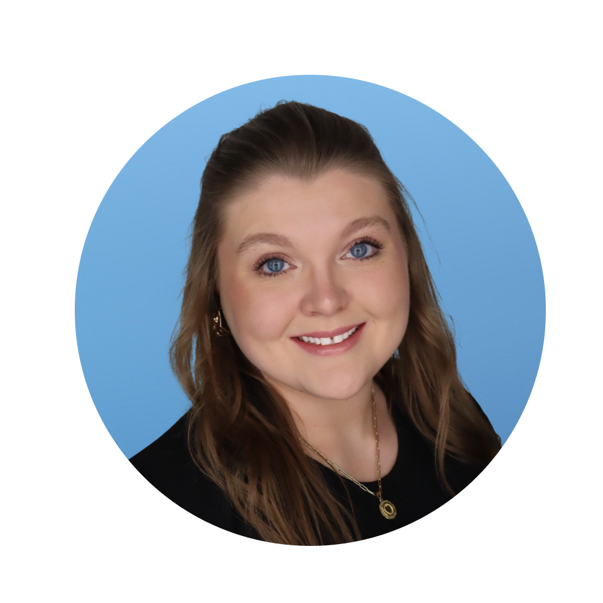
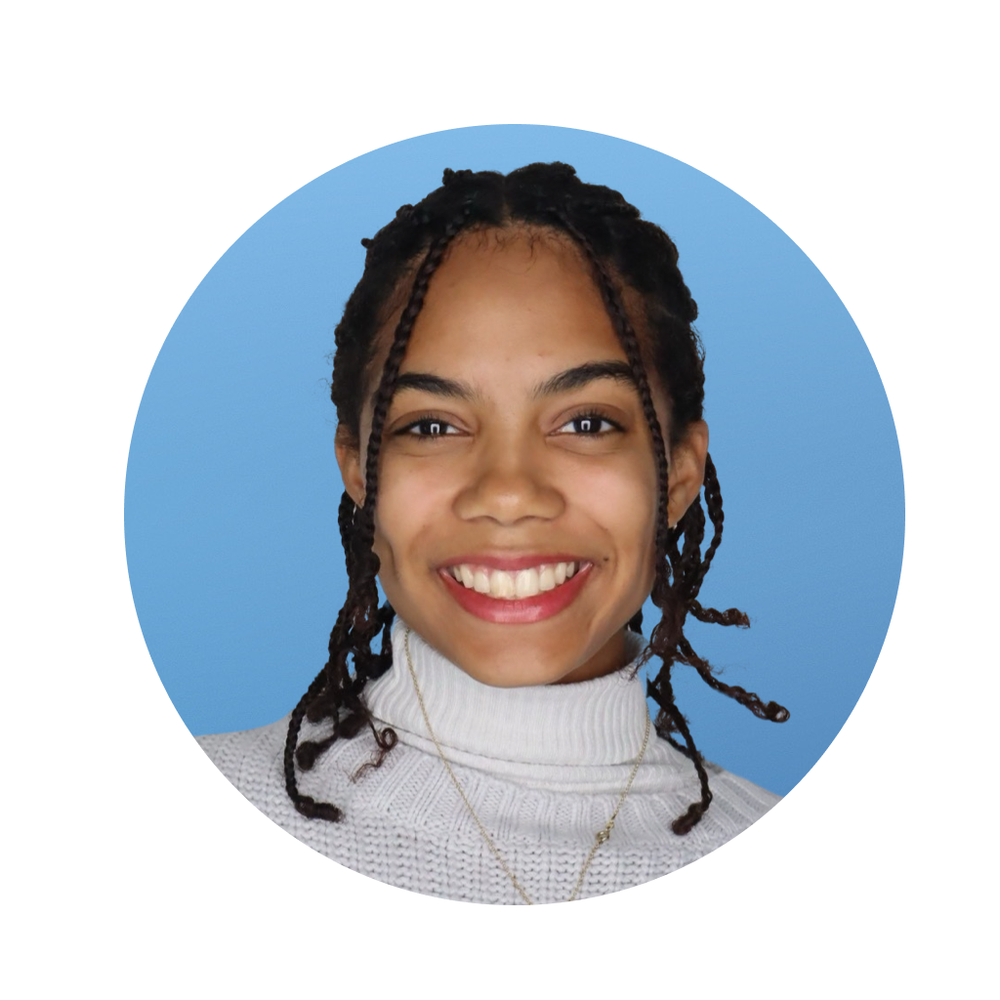

# 🔬 Research Projects

## Apply to a Research Lab

Faculty and Undergraduates in our program collaborate on original scholarship. Consider joining a faculty research lab or working with a mentor toward your career goals. Find the research lab and project that interests you the most and submit your application or express your interest today!


### [OWLLLM](research-projects.md#the-owlllm-lab) 

PI: Dr. Dylan Goldblatt

**O**ptimizing **W**ord **L**earning via **L**arge **L**anguage **M**odels



### [OWLS-CARE](research-projects.md#owls-care-1) 

PI: Dr. Sabine Smith

**O**ptimizing **W**ith **L**eadership **S**kills: **C**areer **A**dvancement **R**esources **E**xplored


***

## The OWLLLM Lab



In 2023 Dr. Goldblatt inaugurated the OWLLLM Lab at KSU. OWLLM combines Owl and LLM because it brings together KSU Owls and LLM technology. The lab name is also an acronym for **O**ptimizing **W**ord **L**earning via **L**arge **L**anguage **M**odels, which is the focus of its research. This research exists to facilitate student success in language education at KSU, where the curriculum emphasizes the learning and retention of high frequency vocabulary in support of rapid second language acquisition.&#x20;

Currently, Dr. Goldblatt is leading students on the following project:

**Artificial Intelligence (AI) and Large Language Models (LLM) as Learning Supports for Second Language Acquisition (SLA)**

This undergraduate research project will explore the potential applications of artificial intelligence (AI) and large language models (LLMs) to support second language learning and instruction. As AI and natural language processing advance rapidly, there is great interest in how these technologies could be leveraged to enhance language learning outcomes and experiences. Our team of undergraduate researchers from linguistics and literature backgrounds will conduct a literature review, propose use cases, and potentially build prototypes to demonstrate the value of AI/LLMs in this domain.




<figure><figcaption>
Dr. Dylan Goldblatt
</figcaption></figure>

The Primary Investigator (PI) of the OWLLM Lab is Dr. Dylan Goldblatt.

* Delivered digital pedagogy workshops on topics like gamification, ePortfolios, and workflows for faculty and grad students at University of Virginia (2013)
* Expertise in narrative, German cinema, and interactive media to inform hypermedia development and analysis for this project
* Chaired "Interactive Digital Narratives" panel and presented theories of mediated encounter at International Conference on Narrative at MIT (2014)
* Collaborated on iterative improvements to email drafting and web articles for L2 learning, published in academic journals (2007-2009)
* Opened and digitized language learning through projects like the open textbook _Der und mehr_ (2020) and as Co-PI on an NSF Cyberlearning grant application



**Application**

The application for AY 2023-24 is now closed. Please contact Dr. Goldblatt to express informal interest and stay in the loop for opportunities as they arise.

**Responsibilities**

Weekly duties will vary by project phase. Students can expect to participate in the following:

1. Background research on AI/LLMs and their capabilities for language tasks
2. Literature review on existing work applying AI/LLMs to language learning
3. Brainstorming and prototyping possible AI applications and learning interactions
4. User testing and evaluation of prototypes (time permitting)
5. Analysis and writeup of findings
6. Preparation of conference presentation.

**Funding**

Undergraduates in the First-Year Scholars Program earn stipends for **up to $2,000** for the first academic year in the lab. There is an additional extension program that students can apply for, and that extension is granted based on successful completion of all project milestones in the first year.

**Outcomes**

Students will conduct this start-to-finish research project and in doing so will build valuable skills for in project management, analysis, software development, language assessment, critical thinking, communication, and collaboration. These include:

Content-Based Outcomes - definitions of LLM/AI terms, improved understanding of linguistics; understanding of prior work through literature review, articulation of the study and its contributions to the field.

Skill-Based Outcomes - design a study to answer a research question, develop a hypothesis, write a research paper, present their research to an audience (e.g., poster)

**Eligibility**

First-year Scholars

* Students must be in their first year of college at KSU with fewer than 30 transfer credits (not including AP and dual enrollment credits).
* To remain in the First-Year Scholars Program in the Spring, students must be enrolled in classes and in good academic standing.
* To receive stipend payments each semester, students in the First-Year Scholars Program are expected to participate in mandatory orientation meetings, as well as attend events and/or workshops hosted by the Office of Undergraduate Research and Peer Mentors.
* The project will be presented at the Symposium of Student Scholars in April.
* Progress Reports and end of semester evaluation forms will be submitted on time to the Office of Undergraduate Research.

All KSU Students

* Students must demonstrate academic achievement, efficient time management, and clarity of digital and face-to-face communication.
* To join the lab, students will perform domain-specific research and apply for grants to fund their participation.
* To continue with the lab, students must achieve milestones as scheduled and pursue research assignments and professional development opportunities as provided.



The OWLLLM Lab is pleased to welcome the following First-Year Scholars in AY 2023-24:

<figure><figcaption>
Cheryl Nguyen
</figcaption></figure>

 

<figure><figcaption>
Daisi Sheridan
</figcaption></figure>

 

<figure><figcaption>
Chloe Johnson
</figcaption></figure>




## The OWLS-CARE Lab 



In 2023 Dr. Smith inaugurated the OWLS-CARE Lab at KSU. OWLS-CARE connects OWLS and CARE because it brings together KSU Owls and the intentional act of caring for and about your leadership skills through exploration and practice. The lab name is also an acronym for **O**ptimizing **W**ith **L**eadership **S**kills: **C**areer **A**dvancement **R**esources **E**xplored, which is the focus of its research. This research exists to facilitate student success in undergraduate education at KSU, where the curriculum emphasizes the development of critical career competencies and leadership skills.

Currently, Dr. Smith is recruiting students for the following OWLS-CARE projects:

**Artificial Intelligence (AI) as Learning Support in WLC Student Success**

This undergraduate research project will explore the potential applications of artificial intelligence (AI) to support student success in developing four critical communication skills (reading, writing, speaking, and listening) in World Language and Culture (WLC) courses. As AI technology and application opportunities evolve rapidly in educational contexts, there is great interest in understanding how AI can be leveraged ethically-responsibly to enhance learners’ experiences, discipline-based skills, and career competencies. Our team of undergraduate researchers will prepare for conference attendance at the [2023 GA Educational Technology (GaETC) Conference Nov. 1-3 in Atlanta, GA](https://conference.gaetc.org/program/), conduct a literature review, propose and potentially implement use cases in Spring 2024 to demonstrate the value of AI in this domain.

**Leadership Skills as Career Competencies: Intentional Practice of Communication in Teams** &#x20;

This undergraduate research project explores how intentional practice of communication in teams supports critical leadership skills as career competencies. Student success in navigating project-based teamwork is of great interest to educators and employers. As demographics in local and international work environments diversify, there is need to learn and practice how we communicate with one another to get the job done. Our team/s of undergraduate researchers will prepare for a transnational seminar in Spring 2024 hosted at KSU by researching, proposing, and potentially implementing community-based projects. Project completion in teams will demonstrate the value of understanding and practicing critical communication skills as well as career competencies identified by [ACTFL](https://edtochangetheworld.com/wp-content/uploads/2019/03/21century\_worldlanguagesmap.pdf) and [NACE](https://www.naceweb.org/uploadedFiles/files/2021/resources/nace-career-readiness-competencies-revised-apr-2021.pdf).&#x20;



The Primary Investigator (PI) of the OWLS-CARE Lab is Dr. Sabine Smith

* Sabine Smith is Professor of German at Kennesaw State University in the Department of World Languages and Cultures.&#x20;
* She has over 30 years of teaching experience with a sustained research interest in cross-cultural comparisons. She facilitates in-class learning and study-/work-away programs in diverse and inclusive modalities.
* With approx. 50 publications and funded grants, she has been recognized in local and international contexts.&#x20;
* Her research has focused on learners’ development of intercultural competence via global learning experiences.&#x20;
* Most recently, co-authored publications report on interdisciplinary, collaborative studies, e.g ”Advancing Intercultural Communication Skills in Diverse Teams: An Intervention Program for Project-Based Engineering Courses“ (JHETP, 2023), “Improving Communication Skills in Global Engineers: Adapting the UNESCO Story Circles Method in an Undergraduate Engineering Course“ (ASEE, 2022), and „Cross-Cultural Contexts of Teaching and Learning: Experiences of International Faculty at a Southeastern University in the United States” (_Currents in Teaching and Learning_, 2022).



**Application**

The application for OWLS-CARE is now open. Applications to work with specific OWLS-CARE projects go through a contract process. [**Please visit our application page to join.**](../forms/join-the-owls-care-lab.md)

**Funding**

Pending approval, the OWLS-CARE project PI, Dr. Smith provides stipends in support of participating students upon satisfactory contract completion and based on specified OWLS-CARE contract criteria.

**Eligibility and Outcomes**

Please note that the eligibilty and outcomes vary by project. See below.

_Artificial Intelligence (AI) as Learning Support in WLC Student Success_

* Students must be enrolled in KSU undergraduate WLC classes and in good academic standing in fall 2023 and spring 2024 – and submit a signed OWLS-CARE contract.
* To receive the stipend payment for attendance of the 2023 conference on November 1-3, 2023 (pending funding), students are expected to participate in the mandatory orientation pre-conference meeting, attend at least 10 sessions/presentations on either days of GaETC on AI applications in the WLC curriculum, report on findings during a post-conference event.
* To receive the stipend payment for conducting a literature review, propose/potentially implement use cases, and present at the KSU Symposium of Student Scholars in April 2024 (pending funding), students are expected to attend subsequent meetings and workshops hosted by Dr. Smith.

_Leadership Skills as Career Competencies: Intentional Practice of Communication in Teams_

* Students must be enrolled in KSU undergraduate WLC classes and in good academic standing in spring 2024 – and submit a signed OWLS-CARE contract.
* To receive the stipend payment (pending funding), students are expected to participate in mandatory meetings, report on progress and findings prior to and during the transnational seminar, as well as attend events and/or workshops hosted by Dr. Smith as appropriate.
* Students will present at the KSU Symposium of Student Scholars in April 2024.




[our-faculty.md](../learn/our-faculty.md)

